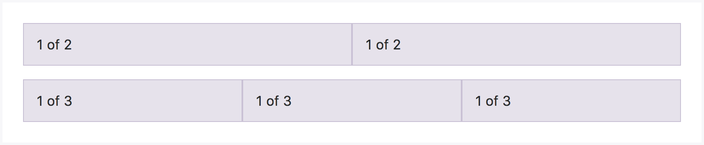
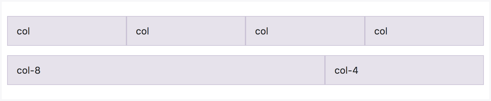
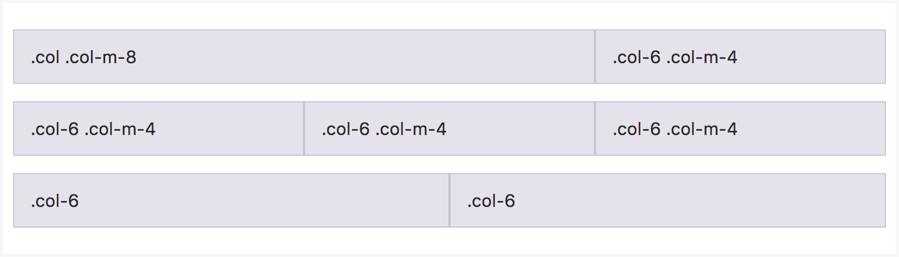
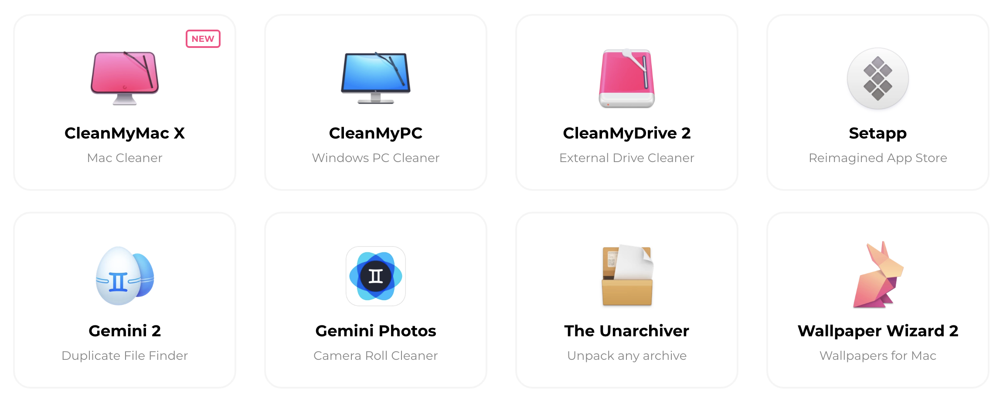

# Grid system

### How it works <a id="Gridsystem-Howitworks"></a>

Our grid system uses a series of containers, rows, and columns to layout and align content. It’s built with flexbox and is fully responsive. Below is an example and an in-depth look at how the grid comes together.


The above example creates three equal-width columns on small, medium, large, and extra large devices using our predefined grid classes. Those columns are centered in the page with the parent `.container`.

Breaking it down, here’s how it works:

* Containers provide a means to center your site’s contents. Use `.container` for fixed width or `.section` for full width.
* Rows are horizontal groups of columns that ensure your columns are lined up properly. We use the negative margin method on `.row` to ensure all your content is aligned properly down the left side.
* Content should be placed within columns, and only columns may be immediate children of rows.
* Column classes indicate the number of columns you’d like to use out of the possible 12 per row. So, if you want three equal-width columns, you can use `.col-xs-4`.
* Column `width`s are set in percentages, so they’re always fluid and sized relative to their parent element.
* There are seven grid tiers, one for each responsive breakpoint: all breakpoints \(extra small\), small, medium, large, and thee extra large sizes \(full hd, 2K, 4K\).

### Grid options <a id="Gridsystem-Gridoptions"></a>

We are using pixels for grid breakpoints and container widths. This is because the viewport width is in pixels and does not change with the font size.

See how aspects of the UI grid system work across multiple devices with a handy table. Gap between 1280 and 1920 - is a 'default' desktop size.

|  | extra small | small | medium | large | extra large | wide screens | 4K |
| :--- | :--- | :--- | :--- | :--- | :--- | :--- | :--- |
| **Container width** | &lt;576px | &lt;768px | &lt;1024px | &lt;1280px | &gt;1920px | &gt;2560px | &gt;3840px |
| **Class prefix** | `.col-xs-` | `.col-s-` | `.col-m-` | `.col-l-` | `.col-xl-` | `.col-xxl-` | `.col-xxxl-` |

### Auto-layout columns <a id="Gridsystem-Auto-layoutcolumns"></a>

Utilize breakpoint-specific column classes for equal-width columns. Add any number of unit-less classes for each breakpoint you need and every column will be the same width.

#### Equal-width <a id="Gridsystem-Equal-width"></a>

For example, here are two grid layouts that apply to every device and viewport



```markup
<div class="container">
  <div class="row">
    <div class="col">
      1 of 2
    </div>
    <div class="col">
      1 of 2
    </div>
  </div>
  <div class="row">
    <div class="col">
      1 of 3
    </div>
    <div class="col">
      1 of 3
    </div>
    <div class="col">
      1 of 3
    </div>
  </div>
</div>
```

#### Setting one column width <a id="Gridsystem-Settingonecolumnwidth"></a>

Auto-layout for flexbox grid columns also means you can set the width of one column and the others will automatically resize around it. You may use predefined grid classes \(as shown below\), grid mixins, or inline widths. Note that the other columns will resize no matter the width of the center column.


```markup
<div class="container">
  <div class="row">
    <div class="col">
      1 of 3
    </div>
    <div class="col-6">
      2 of 3 (wider)
    </div>
    <div class="col">
      3 of 3
    </div>
  </div>
  <div class="row">
    <div class="col">
      1 of 3
    </div>
    <div class="col-5">
      2 of 3 (wider)
    </div>
    <div class="col">
      3 of 3
    </div>
  </div>
</div>
```

### Responsive classes <a id="Gridsystem-Responsiveclasses"></a>

UI grid includes seven tiers of predefined classes for building complex responsive layouts.

#### All breakpoints <a id="Gridsystem-Allbreakpoints"></a>

For grids that are the same from the smallest of devices to the largest, use the `.col` and `.col-*` classes. Specify a numbered class when you need a particularly sized column; otherwise, feel free to stick to `.col`.



```markup
<div class="row">
  <div class="col">col</div>
 <div class="col">col</div>
 <div class="col">col</div>
 <div class="col">col</div>
</div>
<div class="row">
  <div class="col-8">col-8</div>
 <div class="col-4">col-5</div>
</div>
```

#### Mix and match <a id="Gridsystem-Mixandmatch"></a>

Don’t want your columns to simply stack in some grid tiers? Use a combination of different classes for each tier as needed. See the example below for a better idea of how it all works.



```markup
<!-- Stack the columns on mobile by making one full-width and the other half-width -->
<div class="row">
  <div class="col col-md-8">.col .col-md-8</div>
  <div class="col-6 col-md-4">.col-6 .col-md-4</div>
</div>

<!-- Columns start at 50% wide on mobile and bump up to 33.3% wide on desktop -->
<div class="row">
  <div class="col-6 col-md-4">.col-6 .col-md-4</div>
  <div class="col-6 col-md-4">.col-6 .col-md-4</div>
  <div class="col-6 col-md-4">.col-6 .col-md-4</div>
</div>

<!-- Columns are always 50% wide, on mobile and desktop -->
<div class="row">
  <div class="col-6">.col-6</div>
  <div class="col-6">.col-6</div>
</div>
```

### Reordering <a id="Gridsystem-Reordering"></a>

#### Offsetting columns <a id="Gridsystem-Offsettingcolumns"></a>

Move columns to the right using `.offset-left-m-*` classes. These classes increase the left margin of a column by `*` columns. For example, `.offset-left-m-4`moves `.col-m-4` over four columns.


Also, you can move columns to the left \(usefull if you are using right alignment\) .offset-right-m-\*. These classes increase the right margin of a column by \* columns. For example, `.offset-right-m-4` moves `.col-m-4` over four columns.

### Same height for all columns

If you need to create a grid with blocks with the same height just add modifier `-grid-height` to wrapper:

```markup
<div class="row -grid-height">
    <div class="col">
        <div class="some-element"></div>
    </div>
    <div class="col">
        <div class="some-element"></div>
    </div>
</div>
```

How it looks:




